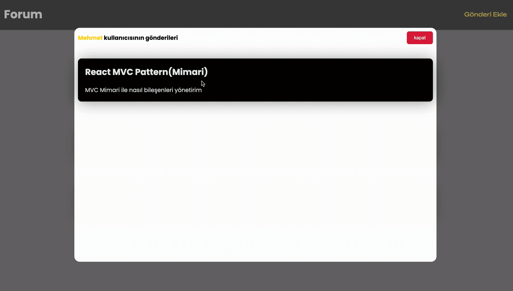

# MVC ( Modern View Controller)

- Model: uygulamanin veri mantigini temsil eder
- - ornek: projede state ini tutacagimiz bir formun obje seklindeki degerleri 

- view: kullanici arayuzunu temsil eder,kullanicinin gordugu kisim
- -  jsx kodlari burada yazilir

- Controller: model ve view arasinda iletisim kurar 
- - kullanici etkilesiminde calisacak fonksiyonlar, api istekleri tutulur

# Kutuphaneler 

- axios
- react-router-dom
- json-server

# Yapilacaklar 

- Api blog verilerini al ` Controller ` 
- - Her blog verisi icin ekrana kart bas ` View ` 
- Bir form arayuzu olusturur `View`
- - Formdaki inputlar degistiginde statelerini tut `Controller`
- - State tutulacak degerleri belirle `Model`
- - Gonderildiginde postu apiye gonder ve kullaniciyi yonlendir 

